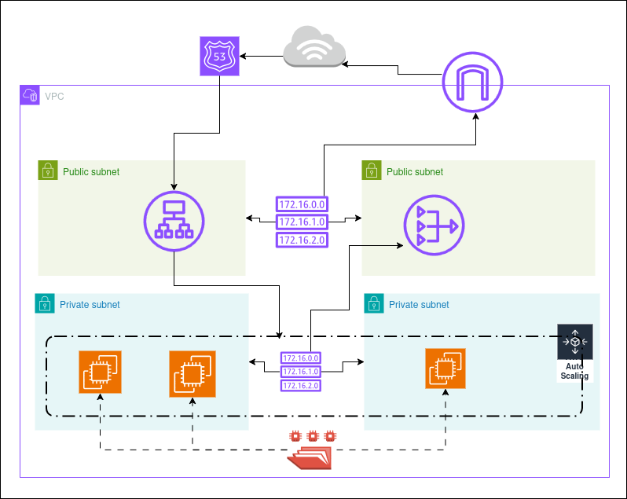

# Infraestructura AWS con Terraform — nClouds Connect 2025

Este repositorio contiene el código Terraform utilizado para desplegar una **infraestructura segura, modular y automatizada en AWS**, desarrollada como parte del programa *nClouds Connect 2025*.

---

## Descripción general

El proyecto implementa una arquitectura completa en la nube utilizando **Infrastructure as Code (IaC)** con Terraform.  
Incluye red, cómputo, almacenamiento, balanceo de carga y DNS, todo configurado de forma automática.

### Componentes principales
- **VPC** con 2 subredes públicas y 2 privadas en distintas zonas de disponibilidad  
- **Internet Gateway** y **NAT Gateway** para la conectividad externa  
- **EFS** como almacenamiento compartido entre instancias  
- **Plantilla de lanzamiento EC2** con Nginx y montaje a EFS  
- **Auto Scaling Group** para alta disponibilidad  
- **Application Load Balancer** con HTTPS (certificado ACM)  
- **Route 53** para el dominio y subdominio personalizado  

## Arquitectura general

## Tecnologías utilizadas

| Herramienta | Uso principal |
|--------------|---------------|
| **Terraform** | Infraestructura como código |
| **AWS** | Proveedor de nube |
| **Nginx** | Servidor web |
| **EFS** | Almacenamiento compartido |
| **ACM + Route 53** | Certificados SSL y DNS |

## Destacados del proyecto

- ✅ VPC y subredes creadas con Terraform  
- ✅ Balanceador de carga HTTPS con certificado ACM  
- ✅ Escalabilidad automática con ASG  
- ✅ EFS compartido entre instancias  
- ✅ Acceso seguro mediante bastión  

## 👤 Autor

**Jorge Zamora**  
🔗 [LinkedIn](https://www.linkedin.com/in/jszp-sebastian-zamora)  
💻 [GitHub](https://github.com/SeZamora)
